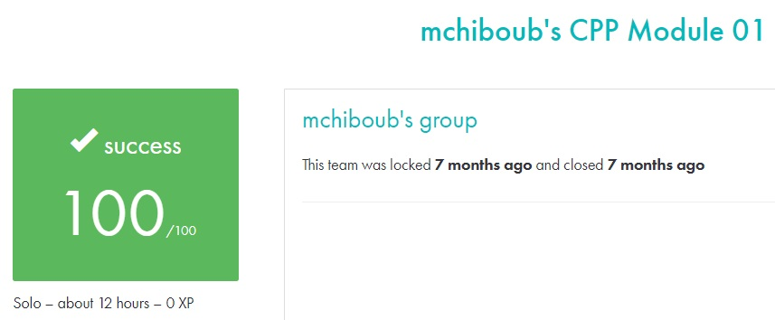

# C++ module 01 #

## What the project does: ##
The C++ - Module 01 project deepens your understanding of C++ by focusing on memory allocation, pointers to members, references, and the switch statement. It includes exercises like managing zombie objects, creating weapon-based classes, manipulating strings, and building a filtering system for different log levels.

## Why the project is useful: ##
This project is useful because it introduces important concepts in C++ programming, such as memory management, references, and pointers, which are crucial for efficient and safe coding. By working through these exercises, you improve your ability to write more complex and maintainable C++ programs.

[Subject of this project](en.subject.pdf)